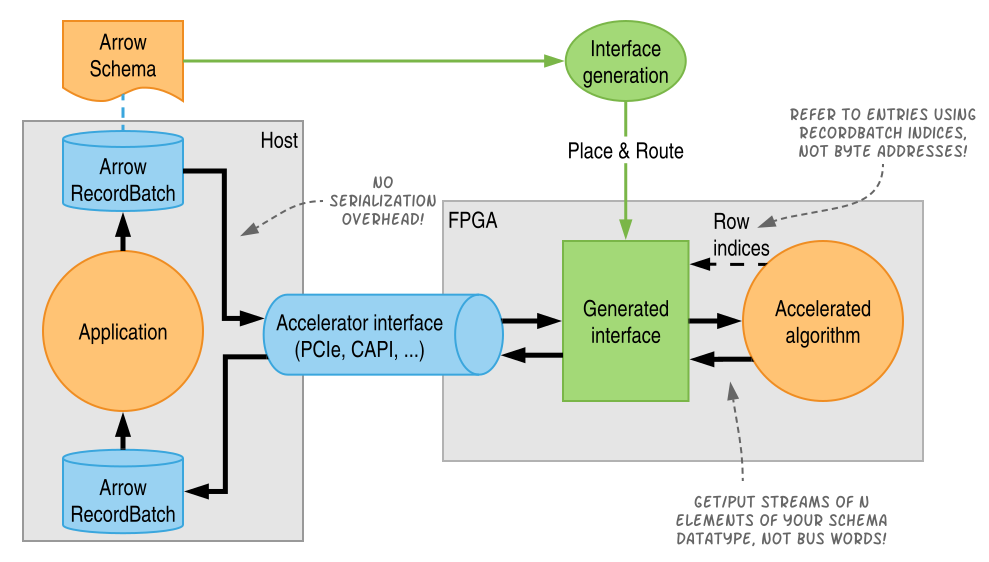

# Fletcher: A framework to integrate FPGA accelerators with Apache Arrow

Fletcher is a framework that helps to integrate FPGA accelerators with tools and
frameworks that use Apache Arrow in their back-ends.

[Apache Arrow](https://arrow.apache.org/) specifies an in-memory format
targeting large datasets and provides libraries for various languages to
interface with the data in that format. Arrow prevents the need for
serialization between different language run-times and provides zero-copy
inter-process communication of datasets. Languages that have Arrow libraries
(under development) include C, C++, Go, Java, JavaScript, Python, Ruby and Rust.

While many software projects can benefit from these advantages, hardware
accelerated applications have also seen serious serialization bottlenecks.
Fletcher focuses on FPGA accelerators. Through Fletcher and Arrow, interfacing
_efficiently_ between FPGA accelerator and high-level language runtimes is made
available to all the supported languages.

Given a set of Arrow
[Schemas](https://arrow.apache.org/docs/format/Columnar.html), Fletcher
generates the following:

- A **high-performance, easy-to-use hardware interface** for your accelerator
  kernel:
  - You provide a range indices of your Arrow RecordBatch (rather than byte
    address).
  - You receive (or supply) streams of the data-type specified by the schema
    (rather than bus words).
  - No pointer arithmetic, reordering, buffering, etc.. required - Fletcher
    does this for you, with high throughput (think system bandwidth).
- A **template** for the accelerator kernel (to be implemented manually or
  using high-level synthesis)
  - You connect directly to **streams** of data from/to your RecordBatch rather
    than some memory bus interface.

## Apache Arrow support

- Fletcher currently supports reading/writing from/to multiple Arrow
  RecordBatches with an Arrow Schema created from any (nested) combination of:

  - Fixed-width primitives (ints, float, etc...)
  - Lists (strings, vectors, etc...)
  - Structs
  - Validity bitmaps

- In the future we would like to support:
  - Sparse and dense unions
  - Dictionaries
  - Chunked tabular structures (`Arrow::Table`)

## Platform support

- Fletcher is **vendor-agnostic**. Our core hardware descriptions and
  generated code are vendor independent; we don't use any vendor IP.
- You can simulate a Fletcher based design without a specific target platform.
- Tested simulators include the free and open-source
  [GHDL](https://github.com/ghdl/ghdl) and the proprietary Mentor Graphics
  Questa/Modelsim, and Xilinx Vivado XSIM.

- The following platforms are (partially) supported (may be work-in-progress):
  - [Amazon EC2 F1](https://github.com/abs-tudelft/fletcher-aws)
  - [Xilinx Alveo](https://github.com/abs-tudelft/fletcher-alveo)
  - [Intel OPAE](https://github.com/abs-tudelft/fletcher-opae)
  - [OpenPOWER CAPI SNAP](https://github.com/abs-tudelft/fletcher-snap)
  - [OpenPOWER OpenCAPI OC-Accel](https://github.com/abs-tudelft/fletcher-oc-accel)
  - Our top-level can be generated to speak AXI, so it should be easy to
    integrate with many existing systems. Requirements for a platform are that
    it provides:
    - An AXI4 (full) interface to memory holding Arrow data structures to
      operate on (data path), and
    - An AXI4-lite interface for MMIO to (control path) registers.

## Current state

Our framework is functional, but experimental and under heavy development.

Especially the development branch (which is currently our main branch) may break
without notice. Some larger examples and the supported platforms are quite hard
to integrate in a CI pipeline (they would take multiple days to complete and
would incur significant costs for platforms such as Amazon's EC F1). For now,
these larger examples and platform support resides in separate repositories
(shown above) and are tested against a specific tag of this repository.

## Further reading

Tutorials:

- [Simple column sum example](examples/sum/README.md) - The "Hello, World!"
  of Fletcher.

Hardware design flow:

- [Fletcher Design Generator](codegen/cpp/fletchgen/README.md) - The design
  generator converts a set of Arrow Schemas
  to a hardware design and provides templates for your kernel.
- [Hardware library](hardware) - All Fletcher core hardware components used
  by the design generator.

Software design flow:

- [Host-side run-time libraries](runtime) - Software libraries for run-time
  support on the host-machine.

## Example projects

- [Simple column sum example](examples/sum/README.md) - The "Hello, World!"
  of Fletcher.
- [String writer](examples/stringwrite) - Writes at over 10 GB/s to a column
  of strings.
- [Primitive map](codegen/test/primmap) - Maps two primitives to two
  primitives (simulation-only, used in testing).
- [String reader](codegen/test/stringread) - Reads some strings
  (simulation-only, used in testing).

External projects using Fletcher:

- [Bolson - A JSON-to-Arrow IPC conversion and Pulsar publish tool.](https://github.com/teratide/bolson)
- [An FPGA-based Parquet-to-Arrow converter](https://github.com/abs-tudelft/fast-p2a)
- [Tidre - Demo application for the Tidre regular expression accelerator](https://github.com/teratide/tidre-demo)
- [Wiki search with Alveo - Very rapidly search a Snappy-compressed version of a Wikipedia database dump](https://github.com/abs-tudelft/wiki-search-alveo)
- [Regular Expression Matching](https://github.com/abs-tudelft/fletcher-example-regexp)
- [K-Means clustering](https://github.com/abs-tudelft/fletcher-example-kmeans)
- [Posit BLAS operations](https://github.com/lvandam/posit_blas_hdl)
- [Posit PairHMM](https://github.com/lvandam/pairhmm_posit_hdl_arrow)

## Publications

If you used or studied Fletcher, please cite:

- J. Peltenburg, J. van Straten, L. Wijtemans, L. van Leeuwen, Z. Al-Ars, and
  H.P. Hofstee, Fletcher: A Framework to Efficiently Integrate FPGA Accelerators
  with Apache Arrow\*, in 29th International Conference on Field Programmable
  Logic and Applications (FPL) (2019) pp. 270–277.

Additional publications:

- J. Peltenburg, J. van Straten, M. Brobbel, H.P. Hofstee, and Z. Al-Ars,
  Supporting Columnar In-memory Formats on FPGA: The Hardware Design of Fletcher
  for Apache Arrow\*, in Applied Reconfigurable Computing, edited by
  C. Hochberger, B. Nelson, A. Koch, R. Woods, and P. Diniz (Springer
  International Publishing, Cham, 2019) pp. 32–47
