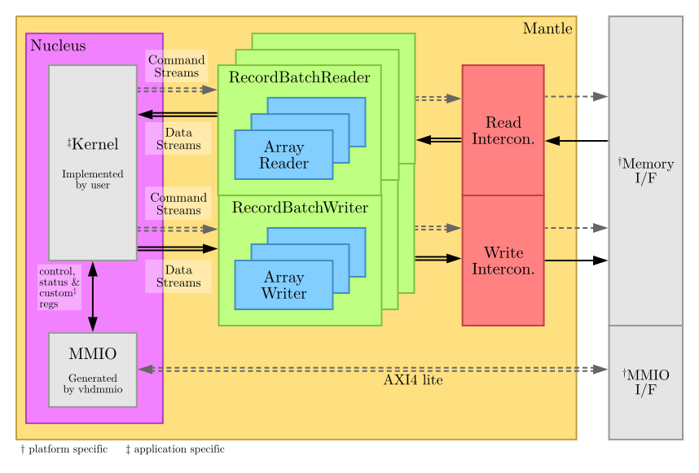

# Fletchgen: The Fletcher Design Generator

Fletchgen is a command-line utility that generates the upper layers of a
hardware design, including simulation and platform-specific top-levels, based on
Arrow Schemas and Recordbatches.

#### What does Fletchgen generate?

- For each **Arrow Field**, an **ArrayReader/Writer** is instantiated.
- For **each Arrow Schema**, a **RecordBatchReader/Writer** is generated and
  wrapper around all ArrayR/W instances.
- For **all Arrow Schemas**, a **Kernel template** is generated.
- The Kernel is wrapped in a **Nucleus** that hides low-level control flow to
  RecordBatchR/W's and instantiates the
  MMIO component that handles AXI4-lite memory-mapped input/output.
- All RecordBatchR/W's and the Nucleus is wrapped by a **Mantle**. The Mantle
  also instantiate the required memory bus interconnection logic.

This can also be shown schematically as follows:


#### What does Fletchgen NOT generate?

Fletchgen does **not** generate the kernel itself.

#### What top-levels does Fletcher generate?

It currently supports only two top-level platforms.

- One platform is a **simulation top-level** that uses a memory model that can
  be filled with RecordBatches.
  - To enable this top-level, use the `--sim` flag.
- The other is an **AXI top-level** that has an AXI4 (full) master port and
  AXI4-lite slave port.
  - To enable this top-level, use the `--axi` flag.

# Prerequisites

- [C++17 compliant compiler](https://clang.llvm.org/)
- [Apache Arrow 6.0+](https://github.com/apache/arrow)
- [CMake 3.14+](https://cmake.org/)

# Build & install

Fletchgen is under heavy development, so for now we'd recommend to make a debug
build using CMake as follows:

```console
git clone https://github.com/abs-tudelft/fletcher.git --recursive
cd fletcher/codegen/cpp/fletchgen
mkdir debug
cd debug
cmake ..
make
sudo make install
```

# Usage

- Read the command-line options.

```console
fletchgen -h
```

An example how to use Fletchgen [can be found here.](../../test/stringread/README.md)

A very gentle tutorial / introduction to Fletcher including how to use Fletchgen
and how to generate input files for Fletchgen
[can be found here.](../../../examples/sum/README.md)

# Supported/required metadata for Arrow Schemas

Fletchgen derives how to use an Arrow Schema from attached key-value metadata
that is stored in Arrow Schemas. You can use this to, for example, prevent the
generation of hardware structures for fields that you're not going to use in
your kernel implementation.

## Schema metadata:

| Key               | Possible values | Default       | Description                                                                                                                                                                                             |
| ----------------- | --------------- | ------------- | ------------------------------------------------------------------------------------------------------------------------------------------------------------------------------------------------------- |
| fletcher_name     | any string      | none          | The name of the schema. This is required for the schema to be identifiable after hardware generation.                                                                                                   |
| fletcher_mode     | read / write    | read          | Determines whether a RecordBatch of this schema will be read or written by the kernel.                                                                                                                  |
| fletcher_bus_spec | aw,dw,lw,bs,bm  | 64,512,8,1,16 | Key to set the bus specification of the RecordBatchReader/Writer resulting from this schema. aw: address width, dw: data width, lw: burst length width, bs: minimum burst size, bm: maximum burst size. |

## Field metadata:

| Key                | Possible values | Default | Description                                                                                                                           |
| ------------------ | --------------- | ------- | ------------------------------------------------------------------------------------------------------------------------------------- |
| fletcher_ignore    | true / false    | false   | If set to true, ignore a specific schema field, preventing generation of hardware to read/write from/to it.                           |
| fletcher_epc       | 1 / 2 / 4 / ... | 1       | Number of elements per cycle for this field. For `List<X>` fields where X is a fixed-width type, this applies to the `values` stream. |
| fletcher_lepc      | 1 / 2 / 4 / ... | 1       | For `List<primitive>` fields only. Number of elements per cycle on the `length` stream.                                               |
| fletcher_profile   | true / false    | false   | If set to true, mark this field for profiling. The hardware streams resulting from this field will have a profiler attached to them.  |
| fletcher_tag_width | 1 / 2 / 3 / ... | 1       | Width of the `tag` field of commands and unlock streams of RecordBatchReaders/Writers. Can be used to identify commands.              |

# Custom MMIO registers

You can add custom MMIO registers to your kernel using `--reg`.
More information [can be found here](../../../docs/mmio.md).

# Custom external I/O

Sometimes, your kernel requires other I/O signals than just Arrow data streams
in and out, and MMIO registers. There may be some other type of data source or
sink in your design, there may be some platform-specific things you want to use,
or etcetera.

You can supply Fletchgen with a YAML file describing what signals you want to
draw between the kernel and the top-level. An example is shown below, where we
want to handshake completion from the platform top-level with a `req` and `ack`
bit.

```yaml
- record:
  name: platform
  fields:
    - record:
      name: complete
      fields:
        - field:
          name: req
          width: 1
        - field:
          name: ack
          width: 1
          reverse: true
```

This will result in the following signals appearing at the top-level:

```vhdl
ext_platform_complete_req : out std_logic;
ext_platform_complete_ack : in  std_logic
```

- The signals are assumed to be driven by the kernel. To drive them from the top
  level, use:

```yaml
reverse: true
```

- Fields with a width of 1 can be forced to be `std_logic_vector` instead of
  `std_logic` by using:

```yaml
vector: true
```

# Further reading

You can generate a simulation top level and provide a Flatbuffer file with a
RecordBatch to the simulation environment. You can use this to debug your
designs in simulation, independent of an FPGA platform specific simulation
environment. [An example is shown here.](../../test/stringread/README.md).
